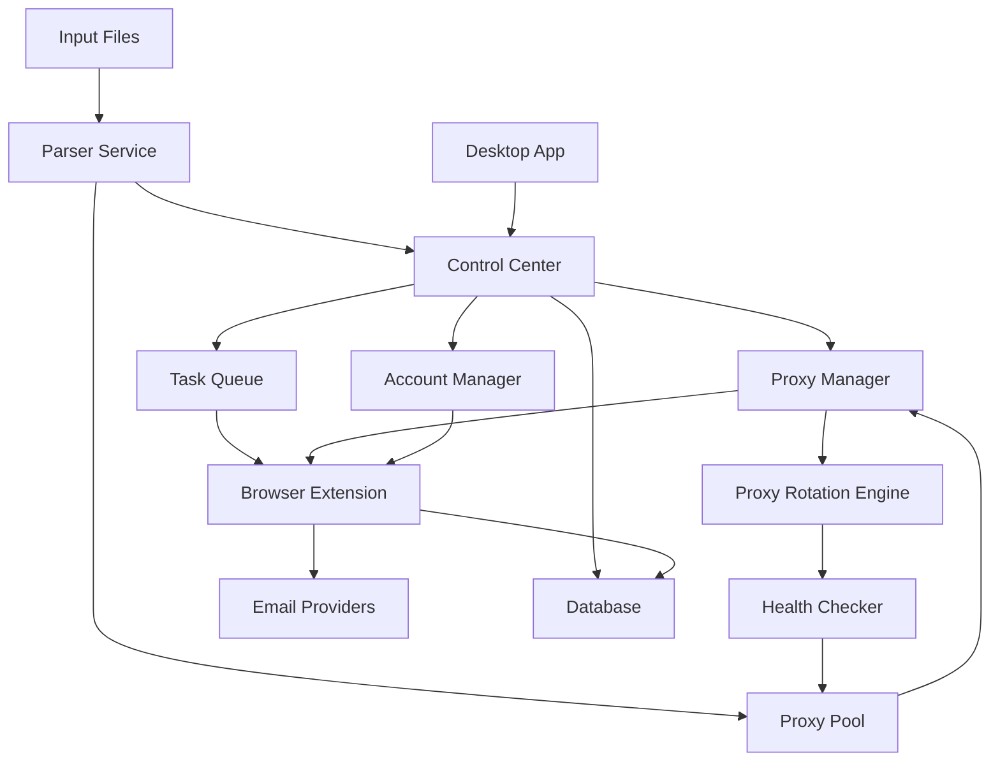
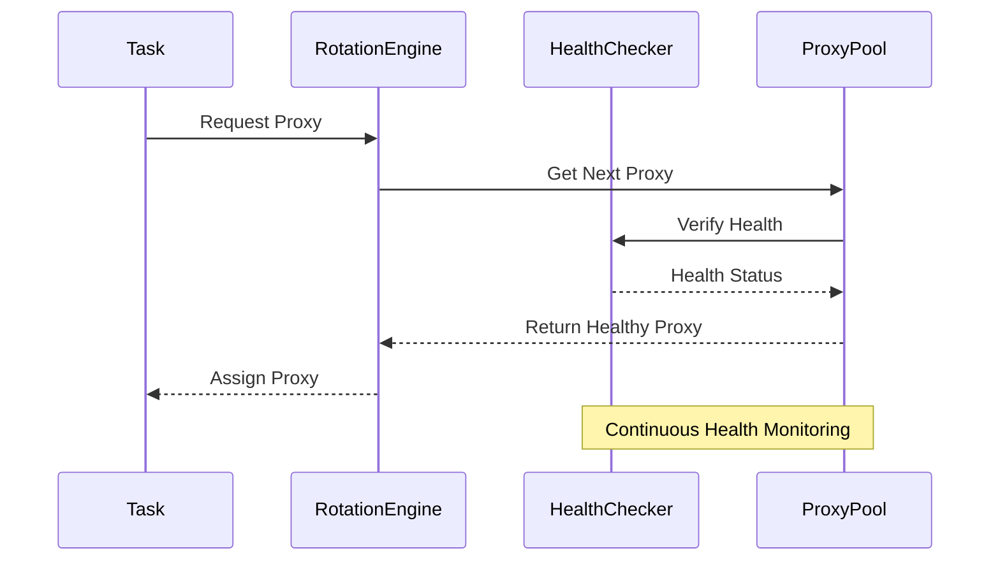
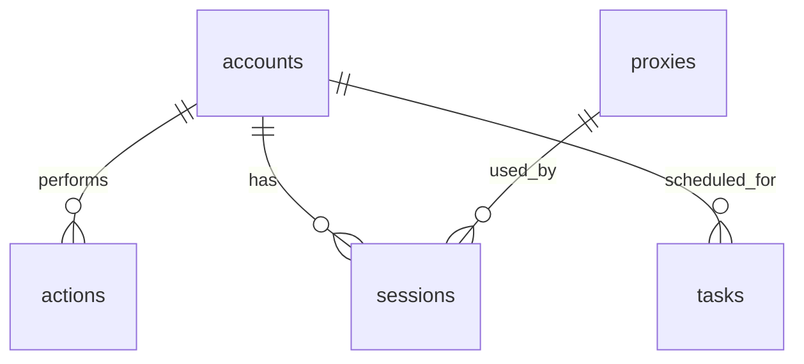
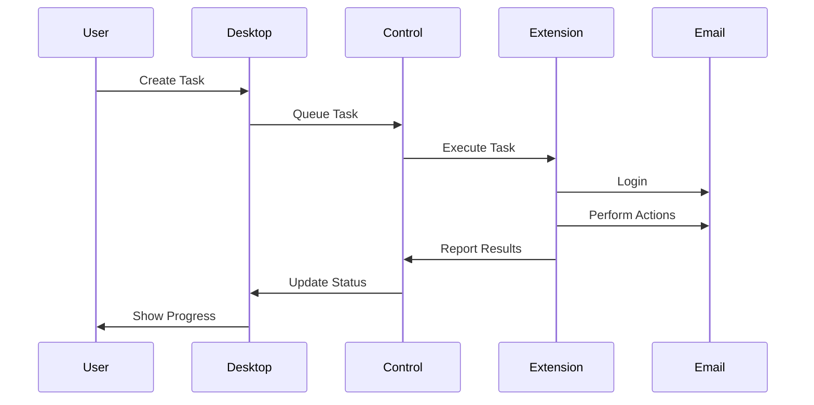

# Email Reputation Automation System

## Table of Contents
1. [System Overview](#system-overview)
2. [Architecture](#architecture)
3. [Database Design](#database-design)
4. [Workflow](#workflow)
5. [Challenges & Mitigations](#challenges--mitigations)
6. [Development Timeline](#development-timeline)

## System Overview

| Component | Description |
|-----------|-------------|
| Purpose | Automated email reputation improvement system |
| Core Features | Account management, action automation, proxy rotation, human-like behavior |
| Tech Stack | Electron, React, TypeScript, Python, PostgreSQL |
| Target Users | Email marketers, sales teams |
| Input Format | CSV/TXT files containing email credentials and proxy lists |
| Proxy Management | Round-robin rotation with health checks and failover |

## Architecture

### High-Level Architecture


### Component Details

| Component | Technology | Responsibility |
|-----------|------------|----------------|
| Desktop App | Electron + React | User interface, task management |
| Parser Service | Python | Process input files, validate data |
| Control Center | Python | Task orchestration, proxy rotation |
| Proxy Pool | Redis | Store and manage proxy list |
| Proxy Rotation Engine | Python | Implement rotation strategies |
| Health Checker | Python | Monitor proxy health and performance |
| Browser Extension | Chrome Extension | Email interaction automation |
| Account Manager | Python | Account credentials, session management |
| Database | PostgreSQL | Data persistence, analytics |

## Input Processing & Proxy Rotation

### Input File Formats
```
# emails.txt/csv
email,password
user1@example.com,pass123
user2@example.com,pass456

# proxies.txt/csv
ip,port,username,password,type
192.168.1.1,8080,user1,pass1,http
192.168.1.2,8080,user2,pass2,socks5
```

### Proxy Rotation Strategy

| Component | Description |
|-----------|-------------|
| Pool Management | Maintains active and backup proxy pools |
| Health Check | Regular testing of proxy performance and availability |
| Rotation Algorithm | Round-robin with weighted distribution based on proxy performance |
| Failover | Automatic switching to backup proxies on failure |
| Session Binding | Consistent proxy assignment for ongoing tasks |

### Proxy Health Metrics
| Metric | Threshold | Action |
|--------|-----------|---------|
| Response Time | < 500ms | Keep in active pool |
| Success Rate | > 95% | Maintain priority status |
| Failure Count | < 3 in 1h | Remove from active pool |
| Availability | > 99% | Keep in primary rotation |

### Rotation Process Flow


## Database Design

### Tables

| Table | Description | Key Fields |
|-------|-------------|------------|
| accounts | Email accounts | id, email, provider, credentials, status |
| proxies | Proxy servers | id, ip, port, type, status, cost |
| actions | Email actions | id, account_id, action_type, timestamp |
| sessions | Browser sessions | id, account_id, proxy_id, status |
| tasks | Automation tasks | id, account_id, action_type, schedule |

### Relationships


## Workflow

### Process Flow


### Action Types
| Action | Description | Human-like Behavior |
|--------|-------------|---------------------|
| Mark Important | Mark email as important | Random delay, mouse movement |
| Move from Spam | Move email to inbox | Natural cursor path |
| Star Email | Add star to email | Variable click position |
| Open Email | Open and read email | Scroll behavior, reading time |
| Reply Email | Send simple reply | Typing speed variation |
| Archive Email | Move email to archive | Natural selection movement |
| Label Management | Create/Apply labels | Multiple click patterns |
| Search Interaction | Search for specific emails | Typing pauses, backspaces |
| Folder Organization | Move between folders | Drag-drop variation |
| Contact Addition | Add sender to contacts | Form fill timing variation |
| Draft Creation | Create and save drafts | Writing pace changes |
| Filter Creation | Set up email filters | Multi-step interaction |
| Settings Adjustment | Modify email settings | Navigation patterns |
| Attachment Handling | Download/View attachments | Loading wait times |
| Link Clicking | Click safe email links | Hover behavior, click timing |

## Challenges & Mitigations

### Bot Detection
| Challenge | Mitigation Strategy |
|-----------|---------------------|
| IP Reputation | Rotate proxies, use residential IPs |
| Behavior Patterns | Randomize actions, add human-like delays |
| Account Activity | Vary action frequency, simulate normal usage |
| Session Patterns | Randomize login times, vary session duration |

### Proxy Management
| Challenge | Mitigation Strategy |
|-----------|---------------------|
| Cost Optimization | Tiered proxy usage based on importance |
| IP Quality | Regular IP testing and rotation |
| Connection Stability | Automatic failover, retry mechanisms |
| Geographic Distribution | Strategic proxy location selection |

### Security
| Challenge | Mitigation Strategy |
|-----------|---------------------|
| Credential Storage | Encrypted storage, secure key management |
| Data Protection | End-to-end encryption, secure protocols |
| Access Control | Role-based permissions, audit logging |
| Compliance | Data retention policies, privacy controls |

## Development Timeline

### Phase 1: Foundation (Weeks 1-2)
- [ ] Project setup and architecture
- [ ] Basic desktop app UI
- [ ] Database schema design
- [ ] Core API endpoints

### Phase 2: Core Features (Weeks 3-4)
- [ ] Account management system
- [ ] Proxy rotation implementation
- [ ] Basic browser extension
- [ ] Action automation framework

### Phase 3: Advanced Features (Weeks 5-6)
- [ ] Human-like behavior simulation
- [ ] Advanced proxy management
- [ ] Task scheduling system
- [ ] Analytics dashboard

### Phase 4: Integration (Weeks 7-8)
- [ ] Desktop-Extension communication
- [ ] Real-time monitoring
- [ ] Error handling system
- [ ] Performance optimization

### Phase 5: Polish & Launch (Weeks 9-10)
- [ ] Security audit
- [ ] Documentation
- [ ] Beta testing
- [ ] Production deployment

## Technical Specifications

### Desktop App
```typescript
interface Task {
  id: string;
  accountId: string;
  actionType: 'mark_important' | 'move_from_spam' | 'star';
  schedule: {
    startTime: Date;
    frequency: 'daily' | 'weekly';
  };
  status: 'pending' | 'running' | 'completed' | 'failed';
}
```

### Browser Extension
```javascript
class EmailAutomation {
  async performAction(action) {
    await this.simulateHumanBehavior();
    await this.executeAction(action);
    await this.reportResults();
  }
}
```

### Proxy Management
```python
class ProxyManager:
    def get_next_proxy(self):
        return self.rotate_proxy()
    
    def validate_proxy(self, proxy):
        return self.test_connection(proxy)
```

## Monitoring & Analytics

| Metric | Tool | Threshold |
|--------|------|-----------|
| Success Rate | Prometheus | > 95% |
| Proxy Cost | Custom Dashboard | < $0.01/action |
| Action Speed | Grafana | 2-5s/action |
| Error Rate | ELK Stack | < 1% |