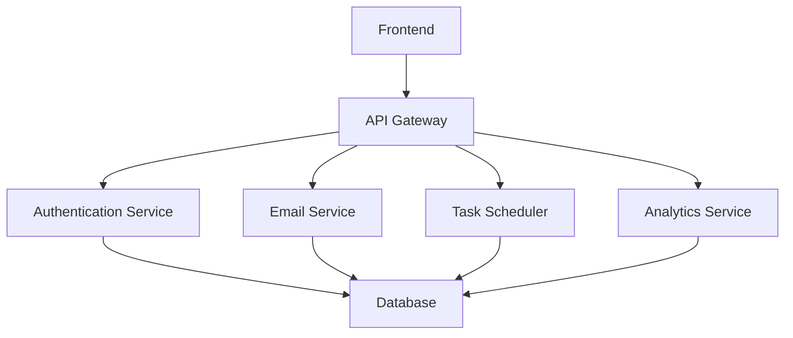
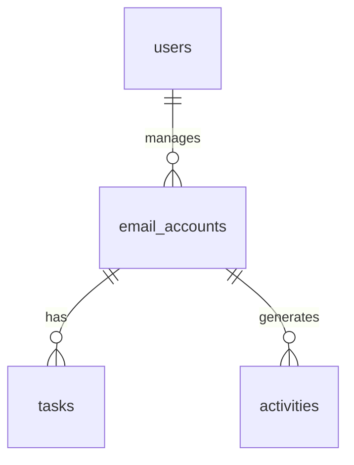

# Email Warmup System Design

## Table of Contents
1. [System Overview](#system-overview)
2. [Architecture](#architecture)
3. [Database Design](#database-design)
4. [API Endpoints](#api-endpoints)
5. [Frontend Components](#frontend-components)
6. [Security Considerations](#security-considerations)
7. [Deployment Strategy](#deployment-strategy)
8. [Timeline](#timeline)

## System Overview

| Component | Description |
|-----------|-------------|
| Purpose | Automated email warmup system to improve email deliverability |
| Core Features | Account management, task scheduling, activity monitoring, analytics |
| Tech Stack | Next.js, TypeScript, Material-UI, FastAPI, PostgreSQL |
| Target Users | Email marketers, sales teams, business owners |

## Architecture

### High-Level Architecture

### Component Details

| Component | Technology | Responsibility |
|-----------|------------|----------------|
| Frontend | Next.js 14 | User interface, real-time updates |
| API Gateway | FastAPI | Request routing, rate limiting |
| Authentication | JWT | User authentication, session management |
| Email Service | Python | Email sending, warmup logic |
| Task Scheduler | Celery | Task management, scheduling |
| Database | PostgreSQL | Data persistence |
| Cache | Redis | Session storage, rate limiting |

## Database Design

### Tables

| Table | Description | Key Fields |
|-------|-------------|------------|
| users | User accounts | id, email, password_hash, role |
| email_accounts | Email accounts to warm up | id, email, provider, status |
| tasks | Warmup tasks | id, account_id, type, schedule |
| activities | Email activities | id, account_id, action, timestamp |
| settings | System settings | id, key, value |

### Relationships

## API Endpoints

| Endpoint | Method | Description | Authentication |
|----------|--------|-------------|----------------|
| /api/v1/accounts | GET | List email accounts | Required |
| /api/v1/accounts | POST | Create new account | Required |
| /api/v1/tasks | GET | List tasks | Required |
| /api/v1/tasks | POST | Create task | Required |
| /api/v1/activities | GET | Get activities | Required |
| /api/v1/settings | GET/PUT | Manage settings | Required |

## Frontend Components

| Component | Description | Technologies |
|-----------|-------------|--------------|
| Dashboard | Overview of system status | Material-UI, Recharts |
| Account Management | Email account CRUD | Material-UI, Formik |
| Task Management | Task scheduling | Material-UI, DataGrid |
| Analytics | Performance metrics | Recharts, Material-UI |
| Settings | System configuration | Material-UI, Formik |

## Security Considerations

| Aspect | Implementation |
|--------|----------------|
| Authentication | JWT with refresh tokens |
| Authorization | Role-based access control |
| Data Encryption | TLS for transit, AES-256 for storage |
| Rate Limiting | Redis-based rate limiting |
| Audit Logging | Comprehensive activity tracking |

## Deployment Strategy

| Environment | Configuration |
|-------------|---------------|
| Development | Docker Compose |
| Staging | Kubernetes |
| Production | Kubernetes with CI/CD |

## Timeline

### Phase 1: Foundation (Weeks 1-2)
- [x] Project setup
- [x] Basic architecture
- [ ] Database design
- [ ] Core API endpoints

### Phase 2: Core Features (Weeks 3-4)
- [ ] Email service implementation
- [ ] Task scheduler
- [ ] Basic frontend
- [ ] Authentication system

### Phase 3: Advanced Features (Weeks 5-6)
- [ ] Analytics dashboard
- [ ] Advanced scheduling
- [ ] Email templates
- [ ] Reporting system

### Phase 4: Polish & Launch (Weeks 7-8)
- [ ] Performance optimization
- [ ] Security audit
- [ ] Documentation
- [ ] Production deployment

## Monitoring and Maintenance

| Metric | Tool | Threshold |
|--------|------|-----------|
| Response Time | Prometheus | < 200ms |
| Error Rate | Grafana | < 1% |
| CPU Usage | Kubernetes | < 70% |
| Memory Usage | Kubernetes | < 80% |

## Future Enhancements

| Feature | Priority | Description |
|---------|----------|-------------|
| AI-powered scheduling | High | Smart task scheduling |
| Multi-tenant support | Medium | Support for multiple organizations |
| Advanced analytics | Medium | Predictive analytics |
| Mobile app | Low | Native mobile experience | 